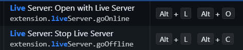

# WAD_Record
WAD lab programs

## Programs List

### P1_FirstWebPage.html
This program demonstrates the use of various HTML heading tags (`<h1>` to `<h6>`) and the `<pre>` and `<p>` tags to display preformatted and paragraph text.

### P2_SecondPage.html
This program demonstrates the use of the `<marquee>` tag for scrolling text, as well as various text formatting tags such as `<strong>`, `<b>`, `<i>`, `<em>`, `<del>`, `<mark>`, `<sup>`, `<sub>`, `<small>`, and `<code>`.

### P3_Hyperlinks.html
This program demonstrates the use of the `<a>` tag to create hyperlinks, including links to other HTML files, images, and external websites.

### P4_EmbeddingAV.html
This program demonstrates how to embed audio and video files in an HTML document using the `<audio>` and `<video>` tags.

### P5_Table.html
This program demonstrates the creation of tables in HTML using the `<table>`, `<tr>`, `<th>`, and `<td>` tags. It includes examples of tables with different attributes such as `border`, `align`, `bgcolor`, `cellpadding`, and `cellspacing`.

### P6_IDcard.html
This program creates a replica of an ID card using HTML and CSS. It includes various elements such as images, text, and styles to mimic the appearance of an ID card.

### P7_frameExp.html
This program demonstrates the use of the `<frameset>` and `<frame>` tags to create a webpage with multiple frames. It includes nested framesets to display different HTML files within the frames.

### P8_formExp.html
This program demonstrates the creation of a form with various input elements such as text fields, radio buttons, checkboxes, color picker, date picker, and file upload. It also includes fieldsets and legends to group related form elements.

### P9_fromExpDemo2.html
This program demonstrates the use of the `pattern` attribute in form input elements to enforce specific input patterns. It includes examples of text and mobile number input fields with pattern validation.

### P10_inlineCSS.html
This program demonstrates the use of inline CSS to style HTML elements. It includes examples of paragraphs and headings with inline styles applied directly to the elements.

### P11_internalCSS.html
This program demonstrates the use of internal CSS to style HTML elements. It includes a `<style>` tag within the `<head>` section to define styles for paragraphs and headings.

### P12_externalCSS.html
This program demonstrates the use of external CSS to style HTML elements. It includes a link to an external CSS file (`style.css`) that defines styles for paragraphs and headings.

### P13_rawXML.xml
This program is an XML document that represents a bookstore with a list of books. Each book has attributes such as category, title, author, year, and price.

### P14_XMLcss.xml
This program is an XML document that represents a collection of messages. It includes a reference to an external CSS file (`msgfile.css`) to style the XML elements.

### P15/bookstore.xml and P15/book.xsl
These programs demonstrate the use of XSLT to transform an XML document into an HTML table. The `bookstore.xml` file contains a list of books, and the `book.xsl` file defines the transformation to display the book data in an HTML table.

### P16_Jquery.html
This program demonstrates the use of jQuery to manipulate HTML elements and handle events. It includes examples of selecting elements, getting and setting values, and handling click, mouse enter, and mouse leave events.

### P17_AngularJs.html
This program demonstrates the use of AngularJS for input validation and backend communication. It includes a form with input fields for name and email, and it sends the form data to a backend server using an HTTP POST request.

## To run all the programs simply open them in browser or use the live server extension by pressing alt+L alt+o 

## How to Run the 17TH Program

1. **Install Node.js**: Ensure that Node.js is installed on your system. You can download it from [nodejs.org](https://nodejs.org/).

2. **Navigate to the Project Directory**: Open a terminal and navigate to the project directory.

3. **Install Dependencies**: Run the following command to install the required dependencies:
   ```sh
   npm install
```

use the live server to run the html code on the browser/view
